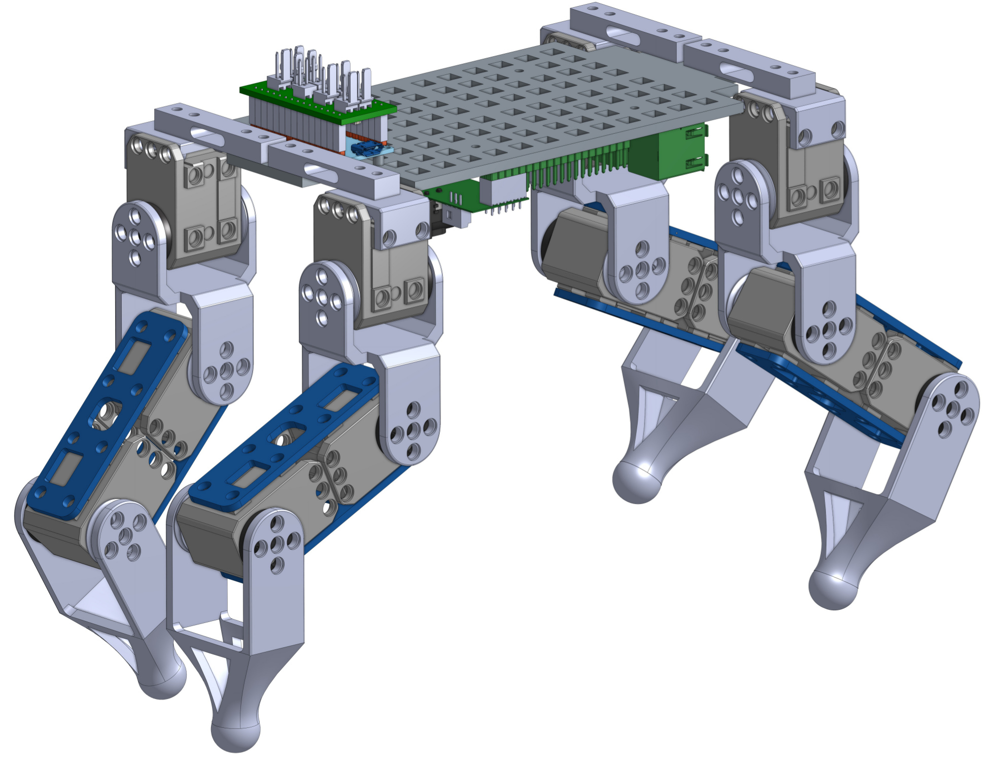

## Roboticia-quattro

Roboticia quattro is an open source quadruped robot. It can be easily 3D printed and laser cutted. It works with Dynamixel XL-320 motors, and a Raspberry Pi for control.

he Roboticia-quattro is suited to understand the walk on four legs and to learn robotic without difficulties.

It is particularly well suited for educational purposes (cheap, simple to assemble, and easily controllable).
There are possibilities of advanced control with its very accurate force sensor on each paw. 
This means that this robot is able to walk on natural ground.

## Contributing

Roboticia-quattro is based on the Poppy project plateform. You can share your experience, new design, ideas or questions on the [Poppy project forum](https://forum.poppy-project.org/).

To contribute to this repository, you can [fork it](https://help.github.com/articles/fork-a-repo/) and propose a [pull request](https://help.github.com/articles/using-pull-requests/) *([Another useful link](https://gun.io/blog/how-to-github-fork-branch-and-pull-request/))*

## License

|   License     |     Hardware    |   Software      |
| ------------- | :-------------: | :-------------: |
| Title  | [Creative Commons BY-SA](http://creativecommons.org/licenses/by-sa/4.0/)  |[GPL v3](http://www.gnu.org/licenses/gpl.html)  |
| Logo  |   |  |

## More on the project

- [Website](http://www.roboticia.com)
- [Facebook](https://www.facebook.com/roboticia)
- [Forum](https://forum.poppy-project.org)
- [Vimeo](https://vimeo.com/roboticia)
